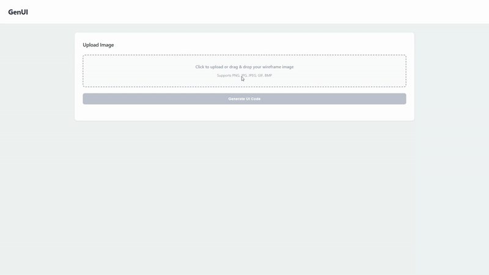
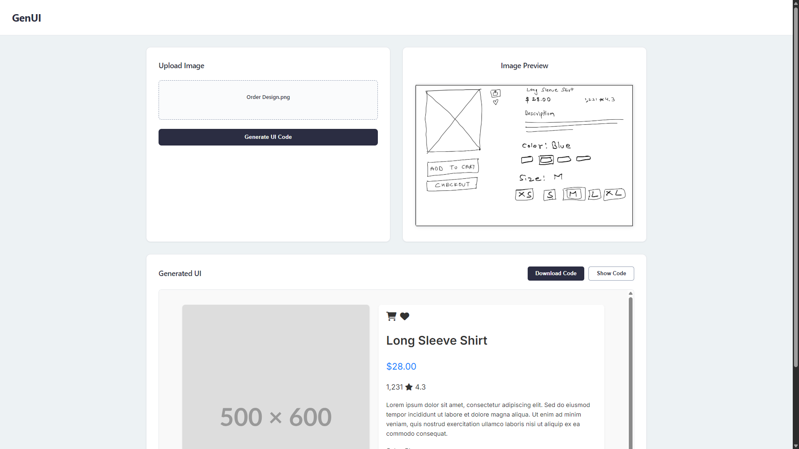

# GenUI - AI Wireframe to Code Generator

GenUI is an intelligent wireframe-to-code generator that transforms your hand-drawn designs into clean, functional HTML/CSS code using Google's Gemini AI. This production-ready full-stack application features a modern React frontend, robust Flask backend, comprehensive monitoring, and flexible deployment options including Docker containerization and cloud hosting.

## Live Demo

**Try GenUI Now**: [https://gen-ui-s294.onrender.com](https://gen-ui-s294.onrender.com)




See GenUI in action! Upload your wireframe and watch it transform into clean, functional code.

## Features

### Core Functionality
- **Drag & Drop Upload**: Easy image upload interface with support for PNG, JPG, JPEG, GIF, BMP
- **AI-Powered Generation**: Uses Google Gemini 2.0 Flash for intelligent wireframe analysis
- **Live Preview**: Toggle between code view and real-time iframe preview
- **Download Code**: Export generated HTML/CSS files instantly

### Advanced Features
- **Flexible API Configuration**: Use your own API key or configure fallback environment variables
- **Comprehensive Logging**: Structured logging with rotation, error tracking, and request monitoring
- **Analytics & Monitoring**: Built-in performance tracking and user interaction analytics
- **Health Monitoring**: `/health` and `/metrics` endpoints for production monitoring
- **Error Handling**: React error boundaries and robust backend error management
- **Production Ready**: Docker support, environment configuration, and deployment guides


## Architecture

**Frontend:**
- React 18.2+ - Modern UI framework with hooks
- Axios - HTTP client for API communication
- CSS3 - Responsive design and animations
- Analytics - Custom event tracking system

**Backend:**
- Flask 2.3+ - Python web framework
- Google Generative AI 0.3+ - Gemini 2.0 Flash model integration
- PIL/Pillow - Image processing
- Structured Logging - Request/response tracking with rotation

**Infrastructure:**
- Docker & Docker Compose - Containerized deployment
- Nginx - Production web server with gzip compression
- Environment Configuration - Multi-environment support

## Setup Options

### Option 1: Local Development

#### Prerequisites
- **Node.js** (v16 or higher)
- **Python** (v3.8 or higher)  
- **Google Gemini API Key** ([Get one here](https://makersuite.google.com/app/apikey))

#### Quick Start
```bash
# 1. Clone and navigate
cd gen-ui

# 2. Install frontend dependencies
cd frontend && npm install

# 3. Install backend dependencies  
cd ../backend && pip install -r requirements.txt

# 4. Configure environment
cp env_example.txt .env
# Edit .env and add: GOOGLE_API_KEY=your_actual_api_key_here

# 5. Start backend (Terminal 1)
python app.py
# Backend runs on http://localhost:5001

# 6. Start frontend (Terminal 2) 
cd ../frontend && npm start
# Frontend runs on http://localhost:3000
```

### Option 2: Docker Deployment (Recommended)

#### Quick Docker Setup
```bash
# 1. Setup environment
cp docker.env.example .env
# Edit .env and add your GOOGLE_API_KEY

# 2. Build and run
docker-compose up --build

# 3. Access application
# Main App: http://localhost
# API Health: http://localhost/health  
# Direct Backend: http://localhost:5001
```

#### Docker Commands
```bash
# Run in background
docker-compose up -d

# View logs
docker-compose logs -f

# Stop services
docker-compose down

# Rebuild specific service
docker-compose build backend
docker-compose build frontend
```

#### Docker Architecture
```
[User Browser] → [Nginx:80] → [React App (Static Files)]
                      ↓
                [Flask API:5001] → [Gemini API]
```

**Services:**
- **frontend**: React app served by Nginx on port 80
- **backend**: Flask API on port 5001  
- **Logs**: Persisted in `./backend/logs/`

### Option 3: Cloud Deployment (Render)

#### Backend Deployment
1. **Create Web Service** in Render
2. **Configure**:
   - Name: `genui-backend`
   - Root Directory: `backend`
   - Runtime: `Python 3`
   - Build Command: `pip install -r requirements.txt`
   - Start Command: `python app.py`
3. **Environment Variables**:
   ```
   GOOGLE_API_KEY=your_actual_api_key
   FLASK_ENV=production
   UI_GENERATION_PROMPT=You are an expert front-end web developer...
   ```

#### Frontend Deployment  
1. **Create Static Site** in Render
2. **Configure**:
   - Name: `genui-frontend`
   - Root Directory: `frontend`
   - Build Command: `npm install && npm run build`
   - Publish Directory: `build`
3. **Environment Variables**:
   ```
   REACT_APP_API_URL=https://your-backend-url.onrender.com
   ```

**Important Notes:**
- Free tier services sleep after 15 minutes of inactivity
- Cold starts take ~30 seconds to wake up
- Keep API keys secure in environment variables

## How to Use


1. **Configure API Key**: Enter your Google AI API key in the input field. 
2. **Upload Image**: Drag & drop or click to upload your wireframe image
3. **Generate**: Click "Generate UI Code" button
4. **Preview**: Toggle between code view and live preview
5. **Download**: Save the generated HTML file

## Monitoring & Analytics

### Health Endpoints
- **Health Check**: `http://localhost:5001/health`
- **Metrics**: `http://localhost:5001/metrics`

### Built-in Analytics
- Session tracking and user interactions
- Performance monitoring and API call metrics
- Error tracking and response times
- File upload analytics

### Logging
- Structured logging with JSON format
- Request/response tracking with duration
- Error logs with stack traces
- Log rotation (10MB max, 5 backups)
- Separate error log files

## Troubleshooting

### API Issues
**"API key not found" error:**
- Ensure `.env` file exists in backend folder
- Check that `GOOGLE_API_KEY` is set correctly
- Verify API key is valid at Google AI Studio

**"Invalid API key" errors:**
- Double-check your API key from Google AI Studio
- Ensure no extra spaces in environment variables

### Connection Issues
**CORS errors:**
- Ensure Flask-CORS is installed: `pip install flask-cors`
- Check that backend is running on correct port

**Frontend can't reach backend:**
- Verify backend is running on port 5001
- Check `REACT_APP_API_URL` environment variable
- Ensure both services are running

### File Upload Issues
**Upload failures:**
- Supported formats: PNG, JPG, JPEG, GIF, BMP
- Maximum file size: 16MB
- Check image file isn't corrupted

### Docker Issues
**Build failures:**
- Check Docker logs: `docker-compose logs`
- Ensure `.env` file has required variables
- Verify Docker and Docker Compose are installed


## Example Wireframes

For best results, your wireframes should include:
- **Clear Layout Structure**: Headers, navigation, content areas, footers
- **Labeled Sections**: Text labels for different UI components
- **Basic UI Elements**: Buttons, forms, images, navigation menus
- **Readable Text**: Even handwritten text should be legible
- **Component Relationships**: Clear indication of how elements connect

## Result



The AI generates clean, semantic HTML with:
- Responsive CSS styling
- Modern layout techniques (Flexbox/Grid)
- Accessible markup structure
- Cross-browser compatibility
- Mobile-friendly design

---
